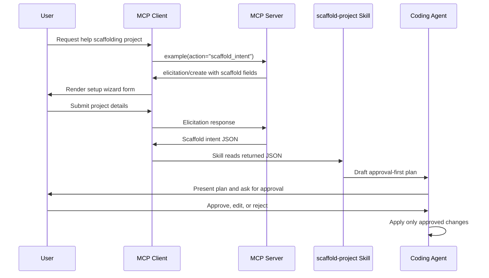

# Scaffold Intent Handoff Spec

## Status

Draft / implemented in template skeleton.

## Purpose

`rmcp-template` provides an MCP elicitation setup wizard that helps a user describe the server they want to scaffold without granting the tool permission to mutate files directly.

The wizard returns structured JSON. A plugin skill then reads that JSON and creates an approval-first implementation plan. The user remains in control because normal editor/plugin permissions govern any later file edits.

## Goals

- Collect scaffold requirements through MCP elicitation when the client supports it.
- Return machine-readable scaffold intent JSON.
- Keep the MCP tool side-effect free: no file writes, deletes, commits, or pushes.
- Use a plugin skill to convert intent JSON into a concrete implementation plan.
- Require explicit user approval before file mutations.
- Encode the surface policy:
  - upstream-client servers require MCP + CLI
  - application/platform servers require API + CLI + MCP + Web

## Non-goals

- Automatically rewriting the repository from inside the MCP tool.
- Generating a complete scaffold in one unreviewed step.
- Treating REST/Web as mandatory for upstream-client servers.
- Replacing normal user/editor permission prompts.

## Actors

| Actor | Role |
|---|---|
| User | Describes the target project and approves/rejects plans. |
| MCP client | Displays elicitation UI and returns user input to the server. |
| MCP server | Runs `scaffold_intent`, validates/normalizes input, returns JSON. |
| Plugin skill | Reads the JSON and drafts an approval-first scaffold plan. |
| Coding agent/editor | Applies approved changes through normal file-edit permissions. |

## High-level flow



## MCP action

### Name

`scaffold_intent`

### Surface

MCP-only.

### Scope

`example:read` in the template. Scaffolded projects should rename this to the service read scope, for example `unraid:read`.

### Rationale for MCP-only

This action depends on MCP elicitation (`peer.elicit::<ScaffoldIntentInput>(...)`) so the server can ask the user for structured input through the MCP client. It has no REST equivalent by default.

A CLI equivalent may be added later if needed, but the current safety model intentionally routes the human-in-the-loop setup through MCP elicitation and a skill handoff.

## Elicitation fields

The current template asks for:

| Field | Type | Purpose | Example |
|---|---|---|---|
| `display_name` | string | Human-readable project name | `Unraid MCP` |
| `crate_name` | string | Cargo package name | `unraid-mcp` |
| `binary_name` | string | CLI/MCP server binary name | `unraid` |
| `server_category` | string | Surface category | `upstream-client` or `application-platform` |
| `env_prefix` | string | Environment variable prefix | `UNRAID` |
| `auth_kind` | string | Upstream auth type | `none`, `api-key`, `bearer`, `oauth`, `other` |
| `resource_groups` | CSV string | Upstream/domain resource groups | `vms, shares, docker` |
| `read_actions` | CSV string | Read-only business actions | `list_vms, get_status` |
| `write_actions` | CSV string | Mutating/destructive business actions | `restart_vm` |
| `mcp_only_actions` | CSV string | Actions that require MCP protocol features | `approve_change` |

## Returned JSON contract

The action returns a JSON object with `kind = "rmcp_template_scaffold_intent"` and `schema_version = 1`.

### Example: upstream-client server

```json
{
  "kind": "rmcp_template_scaffold_intent",
  "schema_version": 1,
  "server_category": "upstream-client",
  "required_surfaces": ["mcp", "cli"],
  "project": {
    "display_name": "Unraid MCP",
    "crate_name": "unraid-mcp",
    "binary_name": "unraid",
    "service_name": "unraid",
    "env_prefix": "UNRAID"
  },
  "upstream": {
    "base_url_env": "UNRAID_API_URL",
    "auth_kind": "api-key",
    "resource_groups": ["vms", "shares", "docker"]
  },
  "actions": {
    "read": ["list_vms", "get_status"],
    "write": ["restart_vm"],
    "mcp_only": [],
    "cli_only_operational": ["serve", "mcp", "doctor", "watch", "setup"]
  },
  "handoff": {
    "recommended_skill": "scaffold-project",
    "instructions": "Create an approval-first scaffold plan from this JSON. Do not mutate files until the user approves the plan."
  },
  "policy": {
    "business_action_minimum_surfaces": ["mcp", "cli"],
    "upstream_client_surfaces": ["mcp", "cli"],
    "application_platform_surfaces": ["api", "cli", "mcp", "web"]
  }
}
```

### Example: application/platform server

```json
{
  "kind": "rmcp_template_scaffold_intent",
  "schema_version": 1,
  "server_category": "application-platform",
  "required_surfaces": ["api", "cli", "mcp", "web"],
  "project": {
    "display_name": "Lab Gateway",
    "crate_name": "lab-gateway",
    "binary_name": "lab",
    "service_name": "lab",
    "env_prefix": "LAB"
  },
  "upstream": {
    "base_url_env": "LAB_API_URL",
    "auth_kind": "oauth",
    "resource_groups": ["agents", "runs", "artifacts"]
  },
  "actions": {
    "read": ["list_runs", "get_run"],
    "write": ["start_run", "cancel_run"],
    "mcp_only": ["approve_run"],
    "cli_only_operational": ["serve", "mcp", "doctor", "watch", "setup"]
  },
  "handoff": {
    "recommended_skill": "scaffold-project",
    "instructions": "Create an approval-first scaffold plan from this JSON. Do not mutate files until the user approves the plan."
  },
  "policy": {
    "business_action_minimum_surfaces": ["mcp", "cli"],
    "upstream_client_surfaces": ["mcp", "cli"],
    "application_platform_surfaces": ["api", "cli", "mcp", "web"]
  }
}
```

## Failure and fallback responses

The action must return graceful JSON for expected elicitation outcomes.

| Condition | Response status field | Behavior |
|---|---|---|
| User submits form | omitted | Return scaffold intent JSON. |
| User submits no input | `no_input` | Return explanatory JSON; no mutation. |
| User declines | `declined` | Return explanatory JSON; no mutation. |
| User cancels | `cancelled` | Return explanatory JSON; no mutation. |
| Client lacks elicitation | `elicitation_not_supported` | Return fallback instructions for manually collecting the same JSON shape. |
| Unexpected elicitation error | error result | Log and return an MCP tool error. |

## Skill handoff

The `scaffold-project` skill is responsible for turning scaffold intent JSON into a plan.

Location:

```text
plugins/example/skills/scaffold-project/SKILL.md
```

The skill must:

1. Read the JSON returned by `scaffold_intent`.
2. Preserve the selected server category and required surfaces.
3. Draft a plan in this order:
   1. Summary
   2. Surface decision
   3. Rename map
   4. Action parity matrix
   5. Files to change
   6. Tests/validation
   7. Approval checkpoint
4. Ask for approval before mutations.
5. Apply only approved changes through normal coding-agent file-edit tools.

The skill must not treat returned JSON as permission to mutate files.

## Surface policy

Every business action must have MCP + CLI parity.

| Server category | Required surfaces | Examples |
|---|---|---|
| `upstream-client` | MCP + CLI | `unrust`, `rustifi`, `rustify`, `rustscale`, `apprise` |
| `application-platform` | API + CLI + MCP + Web | `axon`, `lab`, `syslog` |

Allowed exceptions:

- MCP-only protocol interactions may omit CLI if no non-interactive equivalent exists. The reason must be documented.
- CLI-only operational commands (`serve`, `mcp`, `doctor`, `watch`, `setup`) are not business actions and do not need MCP equivalents.

## Approval boundary

The approval boundary is the key safety guarantee.

`scaffold_intent` may:

- ask questions through elicitation
- normalize user answers
- return JSON

`scaffold_intent` must not:

- write files
- delete files
- run scaffold mutations
- commit changes
- push changes
- install dependencies
- call external project-generation services

The coding agent may mutate files only after the user approves the plan produced from the JSON.

## Implementation mapping

| Concern | File |
|---|---|
| Action metadata and parser | `src/actions.rs` |
| Elicitation implementation | `src/mcp/tools.rs` |
| MCP schema/action enum | `src/mcp/schemas.rs` via `action_names()` |
| Generated schema docs | `docs/MCP_SCHEMA.md` |
| Schema docs generator descriptions | `scripts/check-schema-docs.py` |
| Tool skill reference | `plugins/example/skills/example/SKILL.md` |
| Handoff skill | `plugins/example/skills/scaffold-project/SKILL.md` |
| Web API explorer metadata | `apps/web/lib/template.ts` |

## Validation requirements

After changing this flow, run:

```bash
cargo fmt --package rmcp-template
cargo test --lib
just schema-docs-check
just validate-plugin
pnpm --dir apps/web check
pnpm --dir apps/web typecheck
```

If generated MCP schema docs drift, run:

```bash
just schema-docs
```

## Future extensions

Possible additions that preserve the safety boundary:

- Add a CLI command that reads scaffold intent JSON and prints the same approval-first plan.
- Add JSON Schema for `rmcp_template_scaffold_intent` under `docs/contracts/`.
- Add a dry-run planner command that validates intent JSON without editing files.
- Add optional artifact export, for example writing intent JSON only after explicit user approval.
